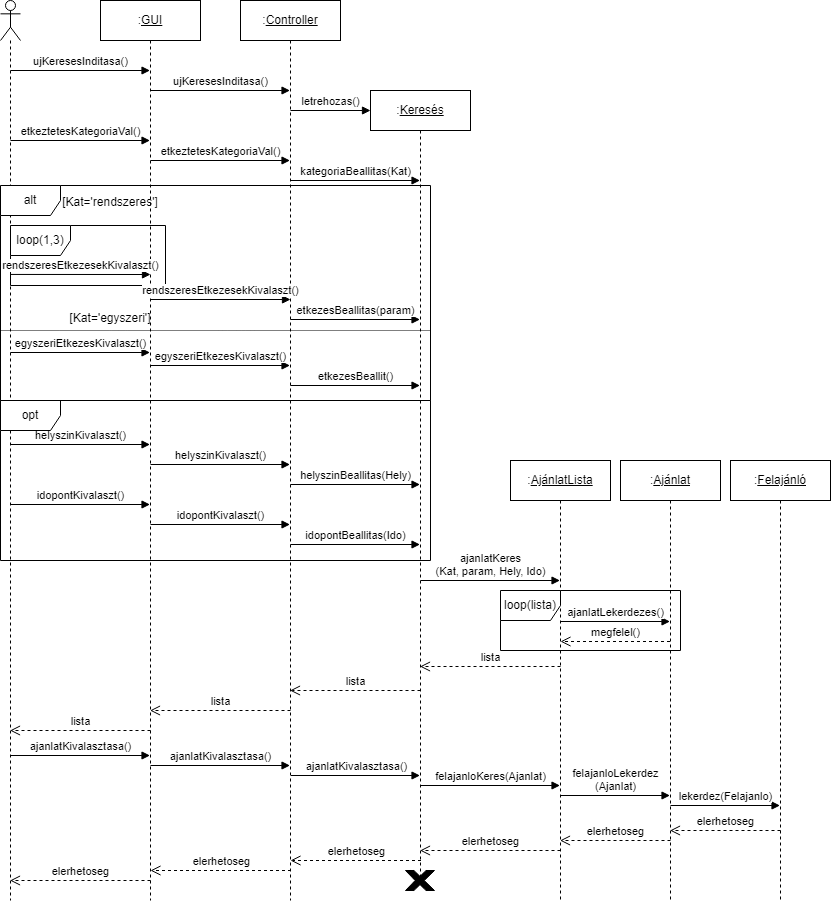

# Szoftvertervezés házifeladat

## Csapattagok - bbm

- Krisztik Bálint
- Mihalik Márk
- Vezse Botond

## Feladatkiírás

**9. Élelmiszer, ill. étkezési lehetőség keresése a felajánlott támogatások között.**

## Aktorok

Primary actor: Rászoruló menekült: Az az ukrán menekült, aki igénybe kívánja venni a rendszeres étkezési segélycsomagot.

## Use case-ek

### UC1: Menekült bejelentkeztetése

#### UC1 Aktor 

Primary actor: Rászoruló menekült

#### Rövid leírás

A már regisztrált rászoruló menekült megadja a regisztrációkor megadott felhasználó nevét és jelszavát. Ezután hozzáfér a rendszer szolgáltatásaihoz.

### UC2: Élelmiszerellátás és felajánlások keresése

#### UC2 Aktor

Primary actor: Rászoruló menekült

#### Részletes leírás

1. A **Rászoruló menekült** elindítja az élelmiszer ellátási szolgáltatások közötti keresés funkciót.
2. A Rendszer megjeleníti a felületet, ahol az alábbiak közül lehet választani:
    - rendszeres étkeztetést
    - vagy egyszeri tartós élelmiszer csomagot szeretne választani
3. A **Rászoruló menekült** kiválasztja a rendszeres étkeztetést.
4. A Rendszer megjeleníti azt a felület, ahol az alábbi étkezések közül lehet választani:
    - reggeli, ami csak hideg étkeztetés lehet
    - ebéd, ami lehet hideg és meleg étkeztetés is
    - vacsora, ami lehet hideg és meleg étkeztetés is
5. A **Rászoruló menekült** kiválasztja a számára megfelelő étkezést és annak jellegét.
6. A Rendszer megjeleníti, azt a felületet, ahol opcionálisan legördülő listákból kiválasztható, hogy hol szeretné igénybe venni vagy átvenni a felajánlást megyére, városra vagy városrészre lebontva.
7. A **Rászoruló menekült** kiválasztja a számára megfelelő helyet vagy üresen hagyja és továbblép.
8. A Rendszer megjeleníti, azt a felületet, ahol opcionálisan kiválaszthatja, hogy mely napon/napokon szeretné a szolgáltatést igénybe venni.
9. A **Rászoruló menekült** kiválasztja a számára megfelelő időpontot vagy időintervallumot vagy üresen hagyja és továbblép.
10. A Rendszer a megjeleníti egy listában a megadott feltételeknek megfelelő ajánlatokat.
11. A **Rászoruló menekült** a listából kiválasztja a számára legmegfelelőbb ajánlatot.
12. Az ajánlat kiválasztása után a Rendszer megjeleníti a felajánló elérhetőségeit.

#### Extensions

3. A **Rászoruló menekült** kiválasztja az egyszeri tartós élelmiszer csomagot, majd a use case a 6. lépéssel folytatódik
10. A Rendszer jelzi, hogy a Rászoruló menekült által kiválasztott feltételek mellett nincs találat az ajánlatok között és új keresési feltételeket kell megadnia, majd a use case a 2. lépéssel folytatódik.
11. A **Rászoruló menekült** bejelöli, hogy meg akarja változtatni a keresési feltételeket, majd a use case a 2. lépéssel folytatódik.
17. A Rendszer jelzi, hogy a Rászoruló menekült által kiválasztott feltételek mellett nincs találat az ajánlatok között és új keresési feltételeket kell megadnia, majd a use case a 2. lépéssel folytatódik.
18. A **Rászoruló menekült** bejelöli, hogy meg akarja változtatni a keresési feltételeket, majd a use case a 2. lépéssel folytatódik.

## Aktivációs Diagram

## System Sequence Diagram

## UseCase Diagram

## Sequence Diagramm

## Design Class Diagramm

